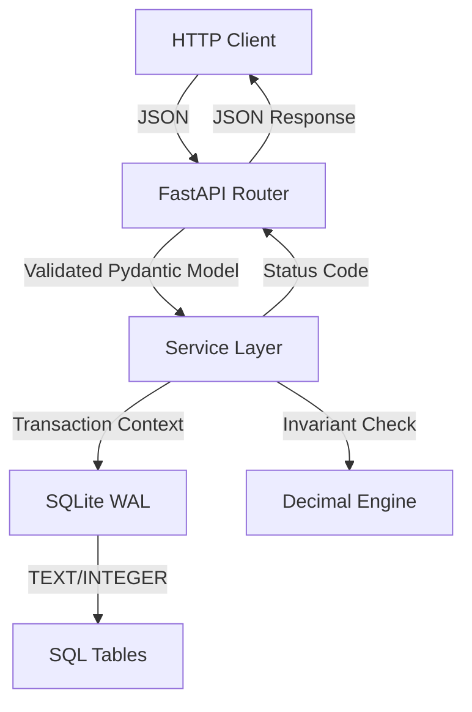

---BEGIN DESIGN.MD---
# Technical Architecture Design: GhostProcess Pocketful Stage 1

## 1. System Overview & Component Topology

The system is a strictly isolated, zero-network backend service designed to enforce double-entry bookkeeping invariants. It operates within a sealed Docker container (`python:3.11-slim`) with no outbound network access.

### 1.1 Layer Separation
The architecture enforces strict separation of concerns to prevent logic leakage and ensure testability:

1.  **Transport Layer (FastAPI Routes):**
    -   Handles HTTP parsing, Pydantic v2 validation, and status code mapping.
    -   Contains **zero** business logic.
    -   Delegates all state mutations to the Service Layer.
2.  **Service Layer (Business Logic):**
    -   Implements the core invariants: Double-Entry creation, Zero-Sum conservation, and Idempotency checks.
    -   Manages transaction boundaries (`BEGIN IMMEDIATE`).
    -   Performs derived balance calculations.
3.  **Persistence Layer (SQLAlchemy 2.0 + aiosqlite):**
    -   Defines declarative models mapping to SQLite tables.
    -   Enforces database-level constraints (FKs, Unique Keys, Not Null).
    -   Configures WAL mode and busy timeouts.
4.  **Data Access Layer (DAO/Repository):**
    -   Abstracts raw SQL queries for specific operations (e.g., `get_balance`, `insert_journal_entry`).
    -   Ensures all numeric data is handled as `Decimal` objects in Python and `TEXT` in SQLite.

### 1.2 Component Topology Diagram


## 2. Mathematical Invariants & Conservation Guarantees

The system is governed by the following non-negotiable mathematical laws. Any violation results in an immediate transaction rollback and HTTP 400/500 error.

### 2.1 Strict Double-Entry Bookkeeping
Every state mutation involving monetary value must produce exactly two journal entries:
1.  **DEBIT:** A negative amount entry on the source wallet.
2.  **CREDIT:** A positive amount entry on the destination wallet.

**Formula:**
$$ \text{Entry}_{debit} = -A $$
$$ \text{Entry}_{credit} = +A $$
Where $A$ is the absolute value of the transfer amount.

### 2.2 Zero-Sum Ledger Conservation
The sum of all journal entries in the system must always equal zero.
$$ \sum_{i=1}^{N} \text{JournalEntry}_i.amount = 0.00 $$
This invariant is verified:
1.  **Per Transaction:** During the atomic commit of a transfer.
2.  **System-Wide:** During `POST /state/import` validation and `GET /state/export` reporting.

### 2.3 Derived Wallet Balances
Wallet balances are **never** stored as independent mutable scalars. They are derived strictly from the immutable ledger history.
$$ \text{Balance}(W) = \sum_{j \in \text{Entries}(W)} \text{Entry}_j.amount $$
Where $\text{Entries}(W)$ is the set of all journal entries associated with Wallet $W$.

### 2.4 Non-Negative Balance Constraint
A transfer is valid only if:
$$ \text{Balance}(\text{Source}) \ge A $$
If $\text{Balance}(\text{Source}) < A$, the transaction is rejected atomically with HTTP 400. No partial writes occur.

### 2.5 Exact Decimal Arithmetic
-   **Type:** Python `decimal.Decimal`.
-   **Precision:** Fixed 2 decimal places.
-   **Quantization Rule:**
    -   Input with $>2$ decimal places (e.g., `"10.999"`) $\rightarrow$ **REJECT** (HTTP 422/400).
    -   Input with $\le2$ decimal places (e.g., `"10.1"`) $\rightarrow$ **NORMALIZE** to `"10.10"`.
-   **Storage:** All monetary values stored as `TEXT` in SQLite to preserve exact string representation.
-   **Arithmetic:** All additions/subtractions performed using `Decimal` arithmetic, never `float`.

## 3. Data Persistence Schema & Integrity Constraints

Database: SQLite 3.
Configuration:
```sql
PRAGMA journal_mode = WAL;
PRAGMA busy_timeout = 5000;
PRAGMA foreign_keys = ON;
```

### 3.1 Table: `wallets`
| Column | Type | Constraints | Description |
| :--- | :--- | :--- | :--- |
| `id` | `TEXT` | `PRIMARY KEY` | Wallet UUID (e.g., `w_12345`) |
| `name` | `TEXT` | `NULLABLE` | Human-readable label |
| `created_at` | `TEXT` | `NOT NULL` | ISO 8601 UTC timestamp |
| `updated_at` | `TEXT` | `NOT NULL` | ISO 8601 UTC timestamp |

### 3.2 Table: `transfers`
| Column | Type | Constraints | Description |
| :--- | :--- | :--- | :--- |
| `id` | `TEXT` | `PRIMARY KEY` | Transfer UUID (e.g., `txn_99999`) |
| `idempotency_key` | `TEXT` | `UNIQUE, NOT NULL` | Client deduplication key |
| `source_wallet_id` | `TEXT` | `NOT NULL, FK -> wallets(id)` | Debited wallet |
| `dest_wallet_id` | `TEXT` | `NOT NULL, FK -> wallets(id)` | Credited wallet |
| `amount` | `TEXT` | `NOT NULL` | Positive decimal string (e.g., `"25.00"`) |
| `status` | `TEXT` | `NOT NULL` | `COMPLETED`, `FAILED`, `PENDING` |
| `created_at` | `TEXT` | `NOT NULL` | ISO 8601 UTC timestamp |

### 3.3 Table: `journal_entries`
| Column | Type | Constraints | Description |
| :--- | :--- | :--- | :--- |
| `id` | `INTEGER` | `PRIMARY KEY AUTOINCREMENT` | Monotonic entry sequence |
| `transaction_id` | `TEXT` | `NOT NULL` | Matches `transfers.id` or seed ID |
| `wallet_id` | `TEXT` | `NOT NULL, FK -> wallets(id)` | Associated wallet |
| `amount` | `TEXT` | `NOT NULL` | Signed decimal string (`-50.00` / `+50.00`) |
| `entry_type` | `TEXT` | `NOT NULL` | `DEBIT` or `CREDIT` |
| `created_at` | `TEXT` | `NOT NULL` | ISO 8601 UTC timestamp |

### 3.4 Table: `idempotency_records`
| Column | Type | Constraints | Description |
| :--- | :--- | :--- | :--- |
| `key` | `TEXT` | `PRIMARY KEY` | Request idempotency UUID |
| `status_code` | `INTEGER` | `NOT NULL` | HTTP status code (e.g., 200, 201, 400) |
| `response_body` | `TEXT` | `NOT NULL` | Stored JSON response string |
| `created_at` | `TEXT` | `NOT NULL` | ISO 8601 UTC timestamp |

## 4. REST Interface Contracts

### 4.1 System & Health
#### `GET /health`
-   **Response `200 OK`**:
    ```json
    {
      "status": "healthy",
      "service": "ghostprocess-pocketful",
      "timestamp": "2026-10-03T18:00:00Z"
    }
    ```

### 4.2 Wallets
#### `POST /wallets`
-   **Request Body**:
    ```json
    {
      "name": "Alice",
      "idempotency_key": "opt-uuid"
    }
    ```
-   **Response `201 Created`**:
    ```json
    {
      "id": "w_12345",
      "name": "Alice",
      "balance": "0.00",
      "created_at": "2026-10-03T18:00:00Z"
    }
    ```
-   **Response `409 Conflict`**: If `id