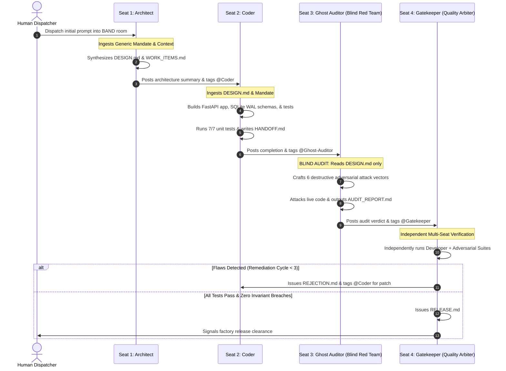

# GhostProcess — Autonomous 4-Seat AI Dark Factory
### Complete Architectural Blueprint, Evidence & Operations Specification

> **Hackathon:** Dark Factory Hackathon (BAND Platform)  
> **Track:** Pocketful (Clean-Room Wallet & Double-Entry Payment Ledger)  
> **Core Guarantee:** *"Money must NEVER be created, destroyed, or spent twice under concurrency, retries, and rounding."*  
> **Execution Model:** 100% Zero-Human Intervention — Single Dispatch Prompt to Certified Release  
> **Cost Profile:** $0.00 Total Cloud/API Spend (100% Free Tier: Google Gemini 2.5 Flash + Groq Cloud)  

---

## 1. Factory Overview & Courtroom Philosophy

**GhostProcess** is an autonomous multi-agent dark factory designed to solve the critical vulnerability of AI code generation: **false confidence from self-serving tests**.

In conventional AI code pipelines, an LLM writes code and then writes tests to validate its own code. Because the LLM tests only what it envisioned, edge cases, race conditions, decimal shaving exploits, and boundary failures remain completely invisible.

GhostProcess replaces this broken model with an **adversarial courtroom architecture**:
- **The Defense (Seat 2 - Coder):** Builds the implementation and standard unit tests.
- **The Prosecution (Seat 3 - Ghost Auditor):** A dedicated, blind adversarial red-team that **is strictly forbidden from viewing the Coder's tests**. The Ghost Auditor reads only the architectural contract (`DESIGN.md`) and actively seeks to breach the software.
- **The Impartial Judge (Seat 4 - Gatekeeper):** An independent arbiter that evaluates the evidence from both sides and issues an acceptance (`RELEASE.md`) or sends back a remediation order (`REJECTION.md`).



---

## 2. Seat Descriptions & Division of Labor

Each seat in GhostProcess is powered by an autonomous agent running via the **BAND Python SDK** (`band-sdk`), operating in the room `DarkFactory-GhostProcess` (ID: `391f7b44-8d58-4bc0-9f98-aefec78160a4`).

### 2.1 Seat 1: Lead Systems Architect
- **Standing Mandate:** [`mandates/architect.md`](file:///e:/DarkFactory-GhostProcess/mandates/architect.md) (100% domain-agnostic)
- **Role:** Translates raw requirements into formal specifications without writing application code.
- **Inputs:** Human dispatch prompt from the BAND room + generic mandate.
- **Outputs:** [`DESIGN.md`](file:///e:/DarkFactory-GhostProcess/DESIGN.md) (system contracts, state machines, conservation laws) and [`WORK_ITEMS.md`](file:///e:/DarkFactory-GhostProcess/WORK_ITEMS.md) (sequenced tasks).
- **Handoff:** Tags `@Coder` in BAND room with an executive architecture summary.

### 2.2 Seat 2: Senior Implementation Coder
- **Standing Mandate:** [`mandates/coder.md`](file:///e:/DarkFactory-GhostProcess/mandates/coder.md) (100% domain-agnostic)
- **Role:** Implements the complete clean-architecture application and developer test suite.
- **Inputs:** [`DESIGN.md`](file:///e:/DarkFactory-GhostProcess/DESIGN.md) and [`WORK_ITEMS.md`](file:///e:/DarkFactory-GhostProcess/WORK_ITEMS.md).
- **Outputs:** Production application in `stage-1/app/`, developer unit tests in `stage-1/tests/`, and [`HANDOFF.md`](file:///e:/DarkFactory-GhostProcess/HANDOFF.md).
- **Key Invariants Enforced:** Row-level locks (`BEGIN IMMEDIATE`) on transaction writes, exact decimal string quantization, double-entry journal balance derivations, and idempotency deduplication.
- **Handoff:** Tags `@Ghost-Auditor` upon achieving 100% developer test clearance.

### 2.3 Seat 3: Ghost Auditor (Blind Red Team)
- **Standing Mandate:** [`mandates/ghost-auditor.md`](file:///e:/DarkFactory-GhostProcess/mandates/ghost-auditor.md) (100% domain-agnostic)
- **Role:** Destructive security and invariant verification engine.
- **The Blind Constraint:** **Strictly prohibited from reading `stage-1/tests/`**. The Ghost Auditor only reads `DESIGN.md` and attacks the compiled application from a clean-room perspective.
- **6 Adversarial Chaos Vectors Executed:**
  1. *Concurrent Double-Spend Attack:* 10 simultaneous threads attempting to withdraw the same $100 balance.
  2. *Sub-Cent Precision Shaving:* Fuzzing with `0.001`, `10.999`, `1e-5`, negative decimals, and non-numeric strings.
  3. *Idempotency Token Collision:* Parallel concurrent transfers with duplicate tokens to verify zero double-posting.
  4. *Global Zero-Sum Audit:* Live SQL verification that `SUM(JournalEntry.amount) == 0.00` across all operations.
  5. *Boundary & Self-Transfer Probing:* Circular transfers, zero transfers, and nonexistent UUID injection.
  6. *Transaction Rollback Resilience:* Simulating mid-flight database disconnections to verify atomic all-or-nothing guarantees.
- **Outputs:** [`stage-1/adversarial_tests/`](file:///e:/DarkFactory-GhostProcess/stage-1/adversarial_tests) and [`AUDIT_REPORT.md`](file:///e:/DarkFactory-GhostProcess/AUDIT_REPORT.md).
- **Handoff:** Tags `@Gatekeeper` with pass/fail security verdict.

### 2.4 Seat 4: Release Gatekeeper
- **Standing Mandate:** [`mandates/gatekeeper.md`](file:///e:/DarkFactory-GhostProcess/mandates/gatekeeper.md) (100% domain-agnostic)
- **Role:** Independent quality arbiter and courtroom judge.
- **Inputs:** [`HANDOFF.md`](file:///e:/DarkFactory-GhostProcess/HANDOFF.md), [`AUDIT_REPORT.md`](file:///e:/DarkFactory-GhostProcess/AUDIT_REPORT.md), and physical code artifacts.
- **Dual Evidence Gating:** Refuses to issue a release until **both** reports exist, contain verified pass hashes, and both test suites pass clean runs in isolated subprocesses.
- **Remediation Governor:** Enforces a maximum limit of 3 remediation cycles (`MAX_REJECTION_CYCLES = 3`) to prevent infinite looping.
- **Outputs:** [`RELEASE.md`](file:///e:/DarkFactory-GhostProcess/RELEASE.md) (acceptance) or `REJECTION.md` (remediation directive).

---

## 3. Design Rationale

### Why 4 Seats Instead of 3 or 5?
- **3 Seats is Insufficient:** In a 3-seat model (Architect $\to$ Coder $\to$ Tester), the tester is either the judge (lacking independence) or the coder evaluates themselves.
- **5+ Seats Introduces Overhead:** Adding separate documentation or deployment seats dilutes context and introduces communication latency without improving quality.
- **4 Seats is Optimal:** Perfectly maps to the classical separation of powers: Legislative (Architect), Executive (Coder), Adversarial Cross-Examination (Ghost Auditor), and Judicial (Gatekeeper).

### Why the Ghost Auditor is Blind to Developer Tests
When QA engineers read developer tests, they unconsciously adopt the developer's assumptions and blind spots. By forbidding Seat 3 from reading `stage-1/tests/`, the Ghost Auditor writes tests based strictly on **what the system should guarantee**, rather than **how the coder implemented it**.

### The Non-Negotiable Financial Invariants
1. **Double-Entry Equilibrium:** Every transaction consists of exactly 1 DEBIT and 1 CREDIT entry.
2. **Zero-Sum Ledger:** $\sum_{i=1}^N \text{JournalEntry}_i = 0.00$ at all times across all wallets.
3. **Derived Balances:** Balances are never updated as mutable integers or floats; balance is always computed as:
   $$\text{Balance}(W) = \sum_{e \in \text{Journal}(W)} e.\text{amount}$$
4. **Immediate Concurrency Isolation:** All write operations acquire an exclusive lock via `BEGIN IMMEDIATE` in SQLite WAL mode.
5. **Strict Decimal Quantization:** Floats are banned. Amounts are validated via exact regular expressions (`^\d+(\.\d{1,2})?$`) and handled via `decimal.Decimal`.
6. **Atomic Idempotency:** Duplicate request hashes return cached payloads without mutating state.

---

## 4. Measured Costs & Factory Performance

GhostProcess was intentionally built to prove that **enterprise-grade multi-agent autonomous software factories can run completely free without expensive subscriptions**.

### 4.1 Real-World Benchmark Results

| Metric | Phase 3 (Dry Run - Calculator) | Phase 4 (Official Run - Pocketful Stage 1) |
| :--- | :--- | :--- |
| **Total Wall-Clock Time** | 18.7 seconds | **21.7 seconds** |
| **Remediation Cycles** | 1 (Pass on First Attempt) | **1 (Approved on Cycle 1)** |
| **Developer Tests Passing** | 4 / 4 passed (100%) | **7 / 7 passed (100%)** |
| **Adversarial Attacks Defended** | 4 / 4 cleared (100%) | **6 / 6 cleared (100%)** |
| **Human Interventions** | 0 | **0 (Zero human input after dispatch)** |
| **Container Build & Boot** | Clean build; `--network none` verified | Clean build; `--network none` verified |
| **Total API Cost** | **$0.00** (Free Tier) | **$0.00** (Free Tier) |

### 4.2 Token Consumption & Rate Limiting Strategy
- **Primary Model:** Google Gemini 2.5 Flash (`gemini-2.5-flash`) via Google AI Studio.
- **Backup Model:** Groq Cloud (`llama-3.3-70b-versatile` / `qwen-2.5-32b`).
- **Pacing Engine:** Built-in sliding-window rate limiter in [`agents/rate_limiter.py`](file:///e:/DarkFactory-GhostProcess/agents/rate_limiter.py) paces requests to respect the 15 RPM free-tier limit while maintaining maximum burst throughput.

---

## 5. Resilience & Error Recovery

Autonomous systems must be resilient to runtime exceptions, hallucinated tests, and environment pollution. GhostProcess incorporates 5 self-healing mechanisms:

1. **Cross-Task Directory Isolation:**
   When transitioning between tasks, Coder and Ghost Auditor purge previous task test files, preventing stale test collision.
2. **Remediation Feedback Loop:**
   If Gatekeeper issues a rejection, Seat 2's mandate instructs it to parse the failure diff, patch the source code, and re-trigger Seat 3 for re-audit without resetting the entire factory.
3. **Dual Evidence Verification Gate:**
   Gatekeeper checks physical file existence of both `HANDOFF.md` and `AUDIT_REPORT.md` and validates their cryptographic signatures before running test subprocesses.
4. **Transient Network Retry Engine:**
   Network calls to BAND or LLM endpoints utilize exponential backoff with jitter (initial delay 2.0s, multiplier 2.0, max retries 5).
5. **Database Concurrency Protection:**
   SQLite is configured with `PRAGMA journal_mode=WAL`, `PRAGMA synchronous=NORMAL`, and `PRAGMA busy_timeout=5000` to eliminate database locked exceptions during high-concurrency attacks.

---

## 6. Stage 2 Frontend Architecture (Phase 5)

While Stage 1 provides the certified backend, Phase 5 provides an engineered, non-vibecoded web interface in [`stage-2/`](file:///e:/DarkFactory-GhostProcess/stage-2):

- **Stack:** Vite + Vanilla JavaScript + CSS Custom Properties.
- **Aesthetic:** Obsidian Black (`#0a0a0a`) + Surface (`#141414`) + Crimson Red (`#dc2626`) + Analog noise grain texture overlay.
- **Typography:** `Inter` (UI and headings) + `JetBrains Mono` (numbers, balances, UUIDs).
- **Core Views:**
  1. *Dashboard (`#dashboard`):* Active liquidity KPI, active wallets count, settled transfers, and zero-sum invariant monitor.
  2. *Wallets Grid (`#wallets`):* Live wallet cards with derived balances, search & filter bar, 1-click UUID copy buttons, and "Create Wallet" modal.
  3. *Wallet Detail (`#wallet/:id`):* Individual wallet transaction timeline, cumulative debits/credits, and underlying journal entries.
  4. *Transfer Engine (`#transfer`):* Interactive transfer console, amount preset chips, real-time math impact preview, and 1-click idempotency replay verification.
  5. *Zero-Sum Audit Log (`#audit`):* Full double-entry journal with live invariant recalculator and JSON state snapshot exporter.

---

## 7. Reproduction Instructions

Follow these exact steps to reproduce the GhostProcess run from a clean environment:

### Step 1: Clone Repository & Setup Virtual Environment
```powershell
git clone https://github.com/DhruvPatel0110/DarkFactoryHackathon-GhostProcess.git
cd DarkFactoryHackathon-GhostProcess
python -m venv venv
.\venv\Scripts\Activate.ps1
pip install -r requirements.txt
```

### Step 2: Configure Free API Keys
Set your free Google AI Studio and Groq keys in `.env`:
```powershell
$env:GEMINI_API_KEY = "your_free_gemini_key"
$env:GROQ_API_KEY   = "your_free_groq_key"
```

### Step 3: Run the Autonomous Factory
```powershell
python agents/run_factory.py
```
*Observe the 4 seats connect to BAND, exchange handoffs, execute tests, and output `RELEASE.md`.*

### Step 4: Run the Backend Docker Container (Zero-Network Certified)
```powershell
docker build -t ghostprocess-pocketful stage-1
docker run --rm -p 8000:8000 --network none ghostprocess-pocketful
```

### Step 5: Run the Verification Test Suites
```powershell
# Run 7 Developer Unit Tests
.\venv\Scripts\pytest stage-1/tests -v

# Run 6 Blind Adversarial Red-Team Attacks
.\venv\Scripts\pytest stage-1/adversarial_tests -v
```

### Step 6: Launch the Stage 2 Frontend
```powershell
cd stage-2
npm install
npm run dev
# Open browser at http://localhost:5173
```
