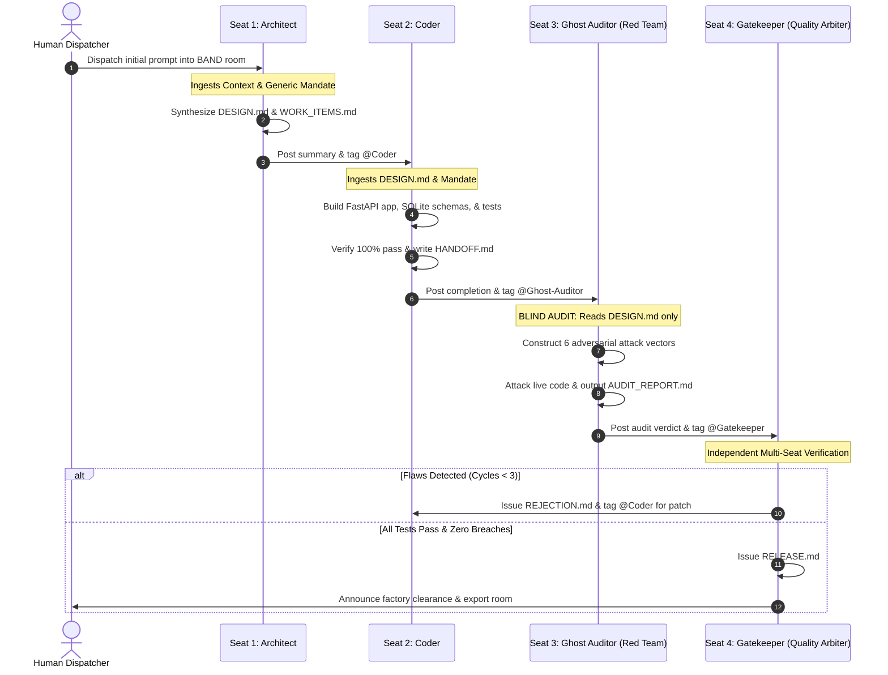

# GhostProcess — Autonomous 4-Seat AI Dark Factory

> **Hackathon:** WeAreDevelopers x BAND Hackathon  
> **Track:** Pocketful (Venmo-like Clean-Room Wallet & Double-Entry Payment Ledger)  
> **Core Guarantee:** "Money must NEVER be created, destroyed, or spent twice under concurrency, retries, and rounding."  
> **LLM Strategy:** 100% Free Tier — Primary: Groq (`openai/gpt-oss-120b`), Fallback: Google Gemini (`gemini-3.8-flash`)  

---

## 1. Executive Overview

**GhostProcess** is an autonomous 4-seat software dark factory operating on the **BAND platform**. Built without proprietary IDE lock-in or paid API subscriptions, GhostProcess autonomously designs, implements, red-teams, and certifies high-integrity financial backend software from a single human dispatch prompt.

### The GhostProcess Differentiator: Blind Adversarial Red-Teaming
Most autonomous coding factories only generate code and run basic unit tests. When faced with high concurrency, race conditions, and penny-shaving exploits, typical AI-generated code fails catastrophically.

GhostProcess introduces **Seat 3: The Ghost Auditor**—a dedicated, blind adversarial red team that is **strictly forbidden from reading the developer's unit tests**. Operating purely from the architectural contract (`DESIGN.md`), the Ghost Auditor unleashes 6 destructive chaos vectors (simultaneous double-spends, fraction shaving, idempotency collisions, and zero-sum invariant audits) to ensure no defect ever reaches production.

---

## 2. Factory Architecture (The 4 Seats)

### 2.1 Seat 1: System Architect
- **Mandate:** [`Agents_Context/architect.md`](file:///e:/DarkFactory-GhostProcess/Agents_Context/architect.md) (100% domain-agnostic)
- **Role:** Decomposes the operational requirements into an unambiguous technical architecture (`DESIGN.md`) and sequenced implementation work items (`WORK_ITEMS.md`).
- **Core Focus:** Establishing mathematical conservation laws, exact decimal string quantization, transaction isolation levels, and interface contracts.

### 2.2 Seat 2: Senior Coder
- **Mandate:** [`Agents_Context/coder.md`](file:///e:/DarkFactory-GhostProcess/Agents_Context/coder.md) (100% domain-agnostic)
- **Role:** Implements the complete clean-architecture application in `stage-1/app/` and standard unit/integration tests in `stage-1/tests/`.
- **Core Focus:** Lock-before-read (`BEGIN IMMEDIATE`) transaction boundaries to eliminate TOCTOU races, exact decimal string validation, idempotency deduplication, and `HANDOFF.md` generation.

### 2.3 Seat 3: Ghost Auditor (Red Team)
- **Mandate:** [`Agents_Context/ghost-auditor.md`](file:///e:/DarkFactory-GhostProcess/Agents_Context/ghost-auditor.md) (100% domain-agnostic)
- **Role:** Blind black-box adversarial penetration tester.
- **The Blind Rule:** Strictly forbidden from reading `stage-1/tests/`. Derives attacks purely from `DESIGN.md`.
- **6 Adversarial Vectors:**
  1. High-concurrency race condition / double-spend attack (10 concurrent requests for same balance)
  2. Precision shaving & scientific notation fuzzing (`0.001`, `10.999`, `1e-5`, negative amounts)
  3. Concurrent idempotency token collisions
  4. Global zero-sum ledger conservation audit (`SUM == 0.00`)
  5. Schema fuzzing, non-numeric strings, and self-transfer boundary probing
  6. State corruption & transaction rollback integrity

### 2.4 Seat 4: Release Gatekeeper
- **Mandate:** [`Agents_Context/gatekeeper.md`](file:///e:/DarkFactory-GhostProcess/Agents_Context/gatekeeper.md) (100% domain-agnostic)
- **Role:** Incorruptible quality gate judge.
- **Verification:** Independently executes both the developer test suite and the adversarial attack suite.
- **Bounded Cycle Engine:** Enforces a maximum of 3 remediation cycles (`MAX_REJECTION_CYCLES = 3`) to prevent runaway loops.
- **Artifacts:** Issues `RELEASE.md` or `REJECTION.md` and triggers automated room session export.

---

## 3. Technology Stack & Zero-Card Infrastructure

- **Agent Runtime & Mesh:** BAND Desktop & Python `band-sdk==4.0.0`
- **Primary AI Engine:** Groq Cloud (`openai/gpt-oss-120b`) — 120B parameter reasoning, 30 RPM limit protected by sliding-window rate limiter.
- **Fallback AI Engine:** Google Gemini (`gemini-3.8-flash`) via `google-genai` SDK.
- **Application Framework:** FastAPI + Uvicorn ASGI.
- **Database Engine:** SQLite 3 in WAL mode with `PRAGMA busy_timeout = 5000` + `aiosqlite` + async SQLAlchemy 2.0.
- **Validation Engine:** Pydantic v2 (strict type enforcement & decimal string parsing).
- **Testing Frameworks:** `pytest`, `pytest-asyncio`, `httpx`.
- **Containerization:** Docker (`python:3.11-slim` base, non-root user, certified for `--network none`).
