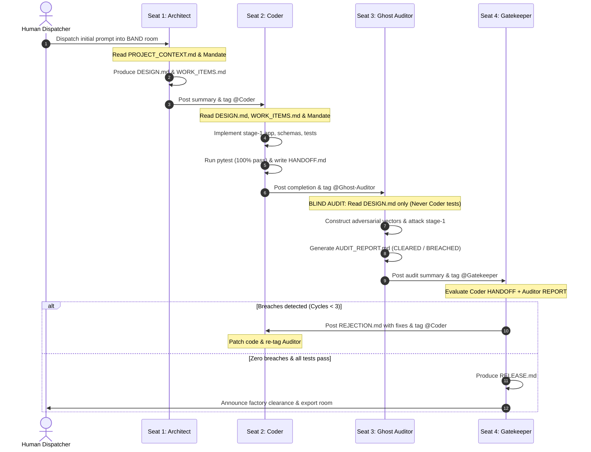

# Project Context: GhostProcess — Pocketful (Payments & Wallet Ledger)

> **Factory System:** GhostProcess Autonomous Dark Factory  
> **Hackathon Track:** Pocketful (Venmo-like Clean-Room Wallet & Payments Engine)  
> **Primary LLM Engine:** Groq (`openai/gpt-oss-120b` / `qwen/qwen3.8-27b`) — High speed, massive 120B parameters, generous limits  
> **Fallback LLM Engine:** Google Gemini (`gemini-3.8-flash`) via `google-genai` SDK  
> **Runtime Target:** Sealed Docker Container (`python:3.11-slim`), Zero-Outbound Network (`--network none`)  
> **Core Guarantee:** "Money must NEVER be created, destroyed, or spent twice under concurrency, retries, and rounding."

---

## 1. Non-Negotiable Invariants (Ground Truth)

Every agent, code commit, database transaction, and audit test **MUST** uphold these mathematical invariants without exception:

1. **Strict Double-Entry Bookkeeping:**
   - Every monetary transfer creates **exactly two journal entries**:
     - Exactly **one DEBIT** (negative amount) on the source wallet.
     - Exactly **one CREDIT** (positive amount) on the destination wallet.
2. **Zero-Sum Ledger Conservation:**
   - `SUM(all journal entries across all wallets) = 0.00` **ALWAYS**.
   - Money cannot enter or exit the system unless explicitly seeded via authorized state import.
3. **Derived Wallet Balances:**
   - A wallet balance is never stored as an independently editable scalar.
   - `Wallet Balance = SUM(journal entries for that wallet)`.
4. **Non-Negative Balance Constraint:**
   - No transfer or debit may ever reduce a wallet's balance below `0.00`.
   - Insufficient funds must fail atomically with an explicit HTTP 400 error and zero journal mutations.
5. **Exact Decimal Arithmetic (NO FLOATING POINT EVER):**
   - **Never** use IEEE floating-point types (`float`, `double`, `REAL`).
   - Use Python's `decimal.Decimal` with explicit 2-decimal-place quantization (`Decimal('0.01')`).
   - **Quantization Rule:**
     - **REJECT** any input with more than 2 decimal places (e.g. `"10.999"`, `"0.001"`). Do NOT silently round.
     - **NORMALIZE** inputs with fewer than 2 decimal places (e.g. `"10.1"` → `"10.10"`).
   - Store all numeric monetary amounts in the database as `TEXT` (e.g. `"150.50"`).
   - In API request/response payloads, all monetary amounts are transferred as strings.
6. **Strict Idempotency on All Mutating Endpoints:**
   - Every write operation (transfer, wallet creation) accepts a client-provided `idempotency_key` (UUID string).
   - Sending the same `idempotency_key` multiple times **must return the exact same response status and body** as the original call without executing a duplicate transaction.
   - Concurrent calls with the same key must safely resolve to a single execution via database unique constraints and immediate transactions.
7. **Atomic Transactions (ACID):**
   - Debit and credit mutations must be committed inside a single database transaction. Partial transfers are catastrophic and strictly prohibited.

---

## 2. Technology Stack & LLM Infrastructure

### 2.1 Backend Application Stack
- **Language:** Python 3.11+
- **Web Framework:** FastAPI (async endpoints, Pydantic v2 schemas, OpenAPI/Swagger docs)
- **ASGI Server:** Uvicorn (`uvicorn app.main:app --host 0.0.0.0 --port 8000`)
- **Database:** SQLite 3 with WAL mode enabled (`aiosqlite` + async `SQLAlchemy 2.0+`)
- **Validation Engine:** Pydantic v2 (strict type enforcement, string-to-decimal parsing)
- **Testing Frameworks:** `pytest`, `pytest-asyncio`, `httpx` (async ASGI client)
- **Containerization:** Docker (`python:3.11-slim` base, non-root user, `--network none` verification)

### 2.2 LLM Engine Strategy
- **Primary LLM:** **Groq** (`openai/gpt-oss-120b` / `qwen/qwen3.8-27b`)
  - Configured via `GROQ_API_KEY` in `.env`.
  - Massive 120B parameter reasoning, high token velocity, generous rate limits (avoiding pipeline stalls).
- **Fallback LLM:** **Google Gemini** (`gemini-3.8-flash`)
  - Configured via `GEMINI_API_KEY` in `.env`.
  - Activated automatically if Groq encounters rate limit (429) or connection exceptions.
- **Pacing & Resiliency:** Sequential agent execution and automatic exponential backoff retry.

---

## 3. Database Schema & Concurrency Design

SQLite tables configured with Foreign Keys enabled, WAL mode, and explicit busy timeout:

```sql
PRAGMA journal_mode = WAL;
PRAGMA busy_timeout = 5000;
PRAGMA foreign_keys = ON;
```

### 3.1 `wallets`
| Column | Type | Constraints | Description |
| :--- | :--- | :--- | :--- |
| `id` | `TEXT` | `PRIMARY KEY` | Wallet UUID |
| `name` | `TEXT` | `NULLABLE` | Human-readable label (e.g., "Alice") |
| `created_at` | `TEXT` | `NOT NULL` | ISO 8601 UTC timestamp |
| `updated_at` | `TEXT` | `NOT NULL` | ISO 8601 UTC timestamp |

### 3.2 `transfers`
| Column | Type | Constraints | Description |
| :--- | :--- | :--- | :--- |
| `id` | `TEXT` | `PRIMARY KEY` | Transfer UUID |
| `idempotency_key` | `TEXT` | `UNIQUE, NOT NULL` | Client deduplication key |
| `source_wallet_id` | `TEXT` | `NOT NULL, FK -> wallets(id)` | Debited wallet |
| `dest_wallet_id` | `TEXT` | `NOT NULL, FK -> wallets(id)` | Credited wallet |
| `amount` | `TEXT` | `NOT NULL` | Positive decimal string (e.g. `"25.00"`) |
| `status` | `TEXT` | `NOT NULL` | `COMPLETED`, `FAILED`, `PENDING` |
| `created_at` | `TEXT` | `NOT NULL` | ISO 8601 UTC timestamp |

### 3.3 `journal_entries`
| Column | Type | Constraints | Description |
| :--- | :--- | :--- | :--- |
| `id` | `INTEGER` | `PRIMARY KEY AUTOINCREMENT` | Monotonic entry sequence |
| `transaction_id` | `TEXT` | `NOT NULL` | Matches `transfers.id` (or seed ID) |
| `wallet_id` | `TEXT` | `NOT NULL, FK -> wallets(id)` | Associated wallet |
| `amount` | `TEXT` | `NOT NULL` | Signed decimal string (`-50.00` / `+50.00`) |
| `entry_type` | `TEXT` | `NOT NULL` | `DEBIT` or `CREDIT` |
| `created_at` | `TEXT` | `NOT NULL` | ISO 8601 UTC timestamp |

### 3.4 `idempotency_records`
| Column | Type | Constraints | Description |
| :--- | :--- | :--- | :--- |
| `key` | `TEXT` | `PRIMARY KEY` | Request idempotency UUID |
| `status_code` | `INTEGER` | `NOT NULL` | HTTP status code (e.g. 200, 201, 400) |
| `response_body` | `TEXT` | `NOT NULL` | Stored JSON response string |
| `created_at` | `TEXT` | `NOT NULL` | ISO 8601 UTC timestamp |

### 3.5 Concurrency & Lock-Before-Read Pattern
To eliminate Time-of-Check-to-Time-of-Use (TOCTOU) races and concurrent double-spends:
- All transfer operations must execute under an immediate transaction write-lock:
  ```python
  async with session.begin():
      await session.execute(text("BEGIN IMMEDIATE"))
      # 1. Check idempotency cache
      # 2. Compute current derived balance
      # 3. Assert balance >= amount
      # 4. Insert transfer + debit journal entry + credit journal entry
      # 5. Insert idempotency record
  ```

---

## 4. REST API Specification

### 4.1 System & Health
- **`GET /health`**
  - **Response `200 OK`**:
    ```json
    {
      "status": "healthy",
      "service": "ghostprocess-pocketful",
      "timestamp": "2026-10-03T18:00:00Z"
    }
    ```

### 4.2 Wallets
- **`POST /wallets`**
  - **Request Body**:
    ```json
    {
      "name": "Alice",
      "idempotency_key": "opt-uuid"
    }
    ```
  - **Response `201 Created`**:
    ```json
    {
      "id": "w_12345",
      "name": "Alice",
      "balance": "0.00",
      "created_at": "2026-10-03T18:00:00Z"
    }
    ```
- **`GET /wallets/{id}`**
  - **Response `200 OK`**:
    ```json
    {
      "id": "w_12345",
      "name": "Alice",
      "balance": "150.00",
      "created_at": "2026-10-03T18:00:00Z"
    }
    ```
  - **Response `404 Not Found`**: `{"detail": "Wallet not found"}`
- **`GET /wallets`**
  - **Response `200 OK`**: List of all wallet objects with dynamically computed balances.

### 4.3 Transfers
- **`POST /transfers`**
  - **Request Body**:
    ```json
    {
      "idempotency_key": "uuid-v4-string",
      "source_wallet_id": "w_12345",
      "destination_wallet_id": "w_67890",
      "amount": "50.00"
    }
    ```
  - **Validation Rules**:
    - `amount` must be a positive decimal string (`> 0.00`) with at most 2 decimal places.
    - `source_wallet_id != destination_wallet_id` (cannot self-transfer).
    - Source and destination wallets must both exist.
    - Source wallet balance >= amount.
  - **Response `201 Created` / `200 OK` (Idempotent replay)**:
    ```json
    {
      "id": "txn_99999",
      "idempotency_key": "uuid-v4-string",
      "source_wallet_id": "w_12345",
      "destination_wallet_id": "w_67890",
      "amount": "50.00",
      "status": "COMPLETED",
      "created_at": "2026-10-03T18:05:00Z"
    }
    ```
  - **Response `400 Bad Request`**: Insufficient funds, invalid precision, negative/zero amount, or self-transfer.
  - **Response `404 Not Found`**: One or both wallets do not exist.
- **`GET /transfers/{id}`**
  - **Response `200 OK`**: Transfer object by ID.
  - **Response `404 Not Found`**: Transfer not found.
- **`GET /transfers`**
  - **Query Params:** `wallet_id` (optional filter), `limit` (default 50), `offset` (default 0).
  - **Response `200 OK`**: List of transfers ordered by `created_at DESC`.

### 4.4 Test Harness State Endpoints (Grading Suite Compliance)
- **`POST /state/reset`**
  - Truncates/clears all tables (`wallets`, `transfers`, `journal_entries`, `idempotency_records`).
  - **Response `200 OK`**: `{"status": "reset_successful"}`
- **`POST /state/import`**
  - Ingests wallets and initial state.
  - **Zero-Sum Validation:** Computes `SUM(journal_entries.amount)` across all imported rows. If `SUM != 0.00`, transaction rolls back and returns HTTP 400.
  - **Response `200 OK`**: `{"imported_wallets": 10, "imported_entries": 20}`
- **`GET /state/export`**
  - Dumps complete database state: wallets with computed balances, transfers, journal entries, and the total ledger sum.
  - **Response `200 OK`**:
    ```json
    {
      "wallets": [{"id": "w_1", "name": "Alice", "balance": "150.00"}],
      "transfers": [...],
      "journal_entries": [...],
      "ledger_sum": "0.00"
    }
    ```

---

## 5. Factory Operating Workflow & Agent Interaction

The Dark Factory coordinates 4 specialized seats inside the **BAND Desktop** room (`ghostprocess-factory`). Agents communicate asynchronously via room tags and structured handoff artifacts:



### 5.1 Mandate Decoupling Architecture
To satisfy hackathon anti-cheating regulations, each agent operates under an independent, 100% generic standing mandate stored in `mandates/`:
- **Seat 1 (Architect):** [`Agents_Context/architect.md`](file:///e:/DarkFactory-GhostProcess/Agents_Context/architect.md)
- **Seat 2 (Coder):** [`Agents_Context/coder.md`](file:///e:/DarkFactory-GhostProcess/Agents_Context/coder.md)
- **Seat 3 (Ghost Auditor):** [`Agents_Context/ghost-auditor.md`](file:///e:/DarkFactory-GhostProcess/Agents_Context/ghost-auditor.md)
- **Seat 4 (Gatekeeper):** [`Agents_Context/gatekeeper.md`](file:///e:/DarkFactory-GhostProcess/Agents_Context/gatekeeper.md)

*Note: Mandates contain zero track-specific vocabulary ("wallet", "transfer", "Pocketful", "FastAPI") to ensure complete domain abstraction.*

### 5.2 Factory Safeguards & Limits
- **Bounded Revision Loop:** Maximum 3 rejection cycles (`MAX_REJECTION_CYCLES = 3`) to prevent infinite loops.
- **Resource Management (8GB RAM):** Agents run sequentially, not in parallel, keeping memory usage well within system headroom.
- **Automated Room Export:** Upon issuing `RELEASE.md`, the orchestrator exports the BAND room transcript to `room-export/room-export.json`.
- **Screen Recording Reminder:** OBS / Windows Game Bar must capture the BAND Desktop window active during the run.

---

## 6. Containerization & Production Standards

- **Base Image:** `python:3.11-slim`
- **Application Directory:** `/app`
- **Port:** `8000`
- **Startup Resilience:**
  - Auto-create runtime data directory (`/app/data`) on startup.
  - Automatically initialize database tables via FastAPI lifespan hook.
- **Zero-Network Isolation:** Service must start and execute all test and operational suites under `docker run --network none`.

---

## 7. Directory Structure Layout

```
ghostprocess/
├── PROJECT_CONTEXT.md          # This authoritative specification file
├── FACTORY.md                  # Factory design, team, & architecture overview
├── README.md                   # Quickstart, video demo link, & submission info
├── requirements.txt            # Root dependencies (band-sdk, groq, google-genai, etc.)
├── .env                        # GROQ_API_KEY & GEMINI_API_KEY (git-ignored)
├── Agents_Context/             # 100% Generic standing mandates
│   ├── architect.md            # Generic system blueprint mandate
│   ├── coder.md                # Generic implementation & developer testing mandate
│   ├── ghost-auditor.md        # Generic adversarial black-box attack mandate
│   └── gatekeeper.md           # Generic evidence evaluation & release mandate
├── agents/                     # Autonomous agent runners
│   ├── config.py               # Groq primary & Gemini fallback LLM config
│   ├── llm_client.py           # Unified Groq/Gemini client with auto-fallback
│   ├── architect.py            # Seat 1 agent loop
│   ├── coder.py                # Seat 2 agent loop (code + tests)
│   ├── ghost_auditor.py        # Seat 3 adversarial red-team loop
│   ├── gatekeeper.py           # Seat 4 judge verification loop
│   └── run_factory.py          # Master multi-agent orchestrator
├── room-export/                # Exported BAND room transcript JSON
│   └── room-export.json
└── stage-1/                    # Production code generated by factory
    ├── Dockerfile              # Production container build
    ├── requirements.txt        # Stage 1 app dependencies
    ├── app/
    │   ├── __init__.py
    │   ├── main.py             # FastAPI entry point & exception handlers
    │   ├── config.py           # Database & server configuration
    │   ├── database.py         # Async SQLite engine, sessionmaker, & WAL setup
    │   ├── models.py           # SQLAlchemy declarative models
    │   ├── schemas.py          # Pydantic v2 schemas (Decimal validations)
    │   ├── routes/
    │   │   ├── __init__.py
    │   │   ├── health.py       # Health check route
    │   │   ├── wallets.py      # Wallet CRUD & balance endpoints
    │   │   ├── transfers.py    # Idempotent double-entry transfer endpoints
    │   │   └── state.py        # Test harness import/export/reset endpoints
    │   └── services/
    │       ├── __init__.py
    │       ├── wallet_service.py
    │       ├── transfer_service.py
    │       └── state_service.py
    ├── tests/                  # Coder's standard unit & integration test suite
    │   ├── __init__.py
    │   ├── conftest.py         # Test fixtures & test DB setup
    │   ├── test_wallets.py
    │   ├── test_transfers.py
    │   ├── test_idempotency.py
    │   └── test_state.py
    └── adversarial_tests/      # Ghost Auditor's attack scripts
        ├── test_double_spend.py
        ├── test_race_conditions.py
        ├── test_precision_rounding.py
        ├── test_input_fuzzing.py
        └── test_state_corruption.py
```
